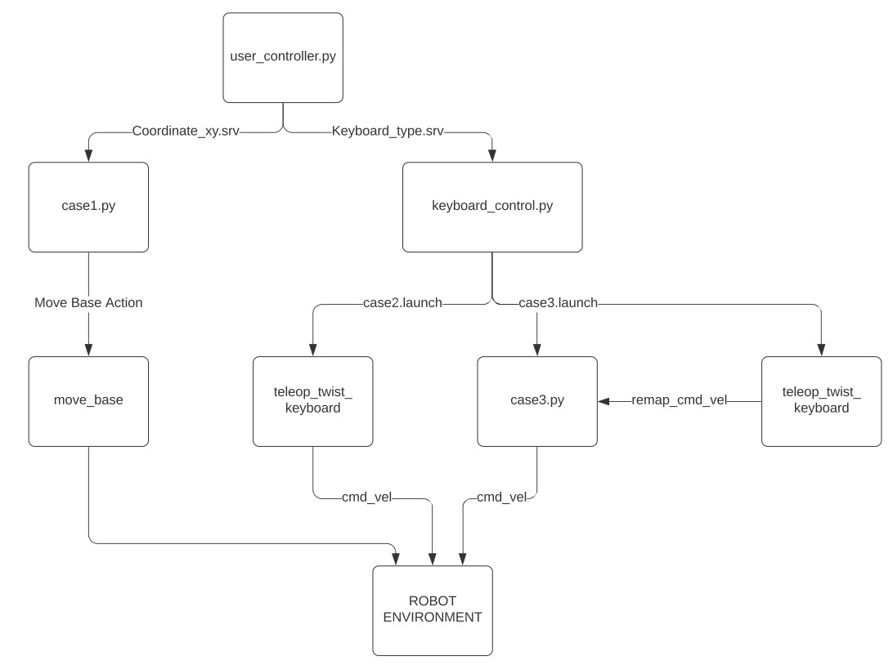

#  Research track 1, assignment 3

## Description of the assignment
In this assignment an environment and a robot is given, also with a mapping system. The goal of the assignment is implementing an user interface that can allows the user to:
- autonomously drive the robot to a specified target (x,y coordinate)
- manually drive the robot via keyboard
- drive the robot via keyboard with the assistance of a collision avoidance system
All the code is developed using ROS environment and in python language.

 
## How to run the code
From a linux shell launch as first the environment and the mapping nodes: 
```
roslaunch final_assignment simulation_gmapping.launch
roslaunch final_assignment move_base.launch
```
Then launch the node which interfaces with the user and the controlling nodes:
```
roslaunch a3_code main_launcher.launch
```


## General scheme and functionality

Following the above general scheme:  
**user_controller** provide a simple interface for the user and, following the user directive, call the specific node to handle one of the three possible actions.  
For communicate with the handler the node uses two different service, the first one is **Coordinate.srv** and it allows to communicate and with **case1 node** that is the handler for the autonomous point reaching. And then using an action communicate with **move_base** a predefined package that provide an autonomous reaching point routine.  
The second service used by '**user_controller**' is **Keyboard_type.srv**, this service allows the user to communicate whether they what to choose option 2 or 3 from the user interface menu.  
Then the service handler will call two different launcher ( **case2.launch** or **case3.launch**) one for each case.  
**case2.launch** simply open the predefined **teleop_twist_keyboard** interface that allows the user to directly control the robot motion.  
**case3.launch**, as the previous one, open **teleop_twist_keyboard** but it also open the **case3 node**, a process that using the laser scanner installed on the virtual robot, check the presence of obstacles in the environment and prevent the user to drive, the robot, into the obstacles.

  


## Some technicalities
### Declaration and use of service
In order to communicate from **user_controller** to the two already mentioned handlers, two similar service had been used. Both uses one or two float number as request (used to pass the selected case or the coordinate ) and both return a integer value containing the status of the response.  
### Use of action
In the **case1 node** an action is used to communicate with the **move_base** package.  
Using **MoveBase** action is quite simple build a goal object, send it and wait for a result from the action handler (already provided). It is also possible to simply cancel the action using the 'cancel' feature of a typical ROS action.
### case3 and topic remapping
The core passage of **case3** is the topic remapping, by default **teleop_twist_keyboard** uses topic **cmd_vel** to communicate the desired velocity ( linear and angular ) to the robot. In **case3 node** topic **cmd_vel**,  from the point of view of **teleop_twist_keyboard**, has been remapped on topic **remap_cmd_vel** (using a launcher file). Then the **case3 node** can read from topic **remap_cmd_vel**, applies the control and rewrites on topic **cmd_vel** for driving the dynamic of the robot.  
**case3 node** also subscribes to **scan** topic, provided by the robot, it returns an array containing the distance of the obstacle in a front and on the tow sides of the robot with a FOV of 180 degrees.  
When the distance in front of the robot or on one of the sides is lower than a certain minimal distance, the node, even if it reads from **remap_cmd_vel** a velocity that will drives the robot into the obstacle, reposts on **cmd_vel** a null velocity in that direction allowing the user to drives backward or turns in the opposite direction (in case of obstacles on side of the robot). Otherwise if the robot is far from an obstacle the node simply repost on **cmd_vel** exactly what it reads from **remap_cmd_vel**.   
Note that the robot has no back sensor so it cannot prevent collisions when moving backward.


## Some additional information on the user interface
After had launched:
```
roslaunch a3_code main_launcher.launch
```
come back on the **main shell** where you should see the options menu, using the keyboard (keys 0,1,2,3) you can select an action.  
After the launch it will also appear a **second shell** (named keyboard_controller.py) , it provides the interface of **telop_twist_keyboard** for options 2 and 3, it can be ignored in option 1.  
Remember, when you are in option 3, if you want to came back to the option menu you have to press ctrl-C **twice**, one for shutting down **teleop_twist_keyboard** and the other one to shut down the **case3 node** (which handles the remapping).  
In case you accidently close the second terminal the simplest thing to do is quit from the user interface node (press key 0) and reopen it with the **main_launcher**.   


<!--stackedit_data:
eyJoaXN0b3J5IjpbMTgwNTQzMTE4LC0zNTgxNjU2Ml19
-->